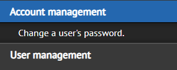

# Specifying metadata about an endpoint

## Endpoint title and description
To set an endpoint's title and description, just write in a docblock at the route declaration. The first paragraph will be used as the title, the rest as the description. Custom formatting (such as `<aside>` tags) is also supported (see the [Pastel docs](http://github.com/knuckleswtf/pastel-js)).

For instance, this:

```js
/**
 * Add a word to the list.
 *
 * This endpoint allows you to add a word to the list. It's a really useful endpoint,
 * and you should play around with it for a bit.
 * <aside class="notice">We mean it; you really should.😕</aside>
 */
app.post('words', (req, res) => {
    
})
```

becomes:


```eval_rst
.. Note:: There needs to be a blank line between the title and description.
```

```eval_rst
.. Tip:: For best results, all free text (title and description) should come before any annotations.
```

## Grouping endpoints
All endpoints are grouped for easy navigation.

To add an endpoints to a group, use `@group` in its docblock, followed by the group's title. You can also add a description using the `@groupDescription` tag.

```eval_rst
.. Tip:: You don't need to specify the :code:`@groupDescription` in every endpoint's docblock. Just use it in one and Scribe'll pick it uo.
```

```js
/**
 * Change a user's password.
 * 
 * @group Account management
 * @groupDescription Managing accounts
 */
app.post('changePassword', (req, res) => {
});
``` 



Grouping endpoints is optional. Any endpoints not in a group will be placed in a default group, "Endpoints" (or whatever is specified in your config file as `defaultGroup`).

## Indicating authentication status
You can use the `@authenticated` annotation on a method to indicate if the endpoint is authenticated. A "Requires authentication" badge will be added to that route in the generated documentation. 

```js
/**
 * Create a user
 * 
 * This endpoint lets you create a user.
 * @authenticated
 *
 */
app.post('/createUser', (req, res) => {
});
```


